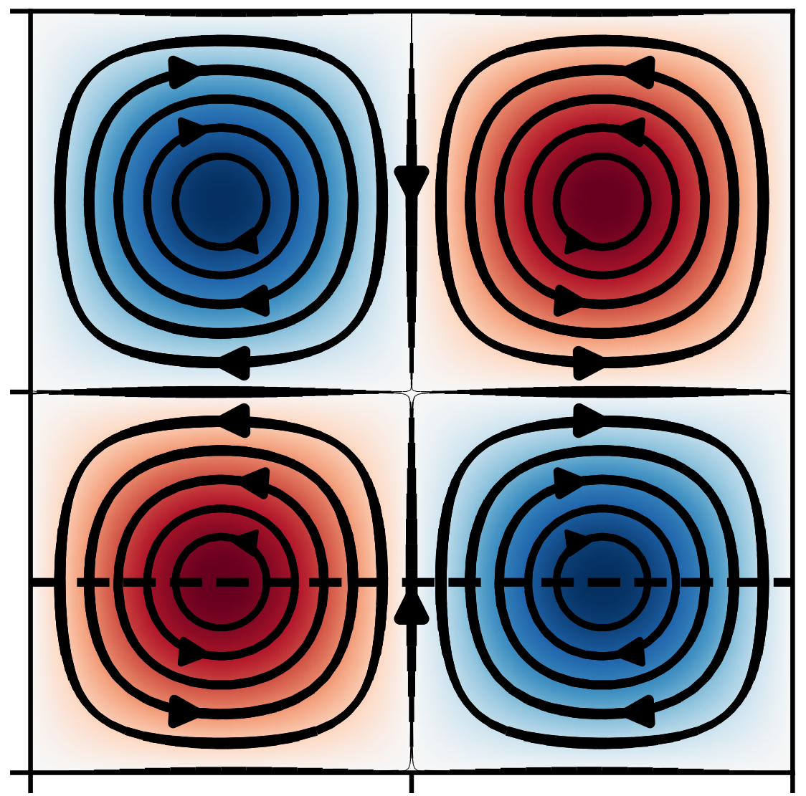
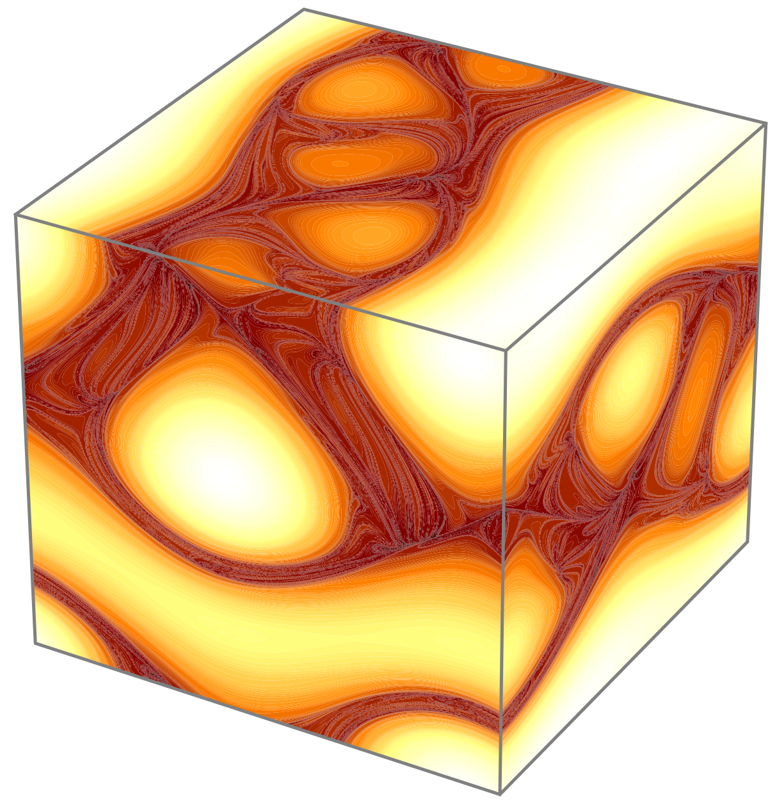
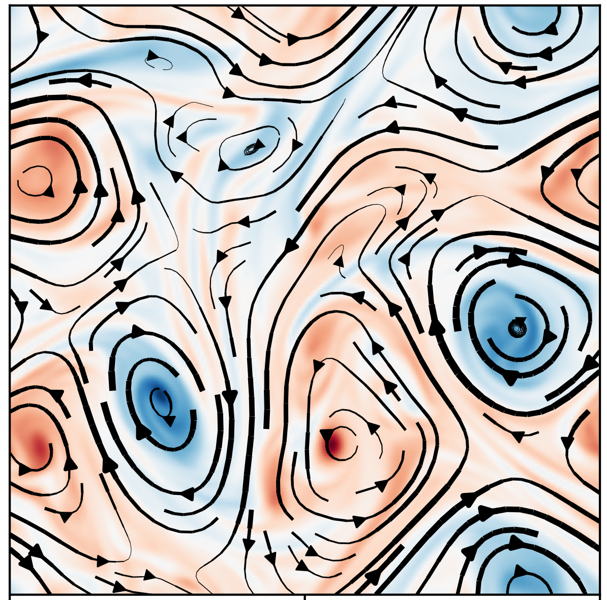
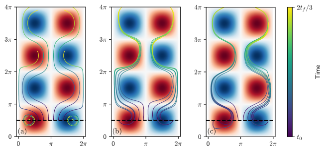
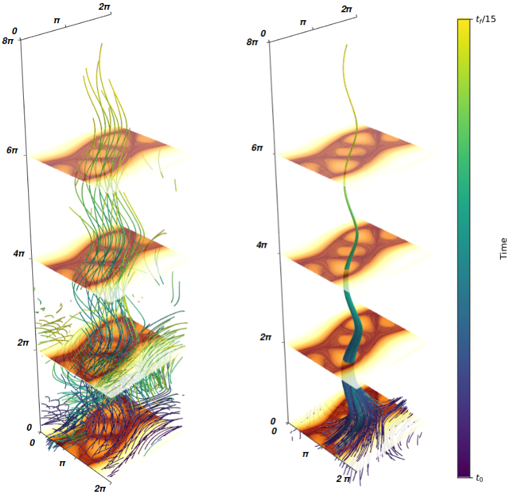

# RL Navigation
[](https://github.com/SelimMecanna/RL_Navigation/blob/master/LICENSE)
[](https://github.com/RichardLitt/standard-readme)

This is a code that simulate the trajectories of active particles in complex flows,
and uses reinforcement learning to optimize the directional navigation task.  
The code is still in active developpement, feel free to ask for features.

This software can utilize user defined flows in which the navigation task is performed (not compatible with 3D transient flows). The user can modify the particle dynamics at will.
This code implements three reinforcement learning algorithms (Q-learning (QL), Advantage Actor-Critic (A2C), and Proximal Policy Optimization (PPO))
in order to optimize the directional task, with LSTM support for PPO which is based on the following [implementation](https://iclr-blog-track.github.io/2022/03/25/ppo-implementation-details/).

All the environments are [GYM](https://www.gymlibrary.dev/index.html) compatible, meaning any alternative reinforcement learning library such as [Stable Baselines](https://stable-baselines3.readthedocs.io/en/master/) can be used to optimize them.
This software should be usable on any operating system but only have been tested on recent Linux Ubuntu distributions.

<div align="center">


*Examples of active particle trajectories in **Taylor Green Vortices** and **2D Turbulence** where the goal is to go up as far as possible. The **Naive** strategy in **black** simply goes up, and the **learned PPO strategy** in **white** benefits from vortices to propel it in the target direction.*
 </div>

This software has been produced during my PhD thesis and as part as the European Research Council project: [C0PEP0D](https://c0pep0d.github.io/). It has been used in a 
[publication](https://openreview.net/forum?id=9JAajeK84e).

## Table of Contents
* [Installation](#installation)
    * [Requirements](#requirements)
    * [Installing](#installing)
* [How to use RL_Navigation?](#how-to-use-rl_navigation)
    * [First steps](#first-steps)
    * [Changing parameters for learning](#changing-parameters-for-learning)
    * [Evaluating a policy](#evaluating-a-policy)
    * [Visualizing a learned policy](#visualizing-a-learned-policy)
* [Known issues](#known-issues)
* [Authors](#authors)
* [License](#license)
* [Acknowledgements](#acknowledgements)

## Installation
### Requirements
RL-Navigation requires Python 3.8.
Dependencies are listed in [requirements.txt](https://github.com/SelimMecanna/RL_Navigation/blob/master/requirements.txt),
missing dependencies will be installed automatically.

### Installing

Start by cloning this repository with its submodules.

```sh
git clone https://github.com/SelimMecanna/RL_Navigation.git
```
Create the virtual environment.
This code use an older version of setuptools and wheel so that it is compatible with gym==0.21 [see](https://github.com/openai/gym/issues/3176).

```sh
virtualenv -p python3.8 venv --no-setuptools --no-wheel
source venv/bin/activate
pip install setuptools==60.2.0 wheel==0.37.1
```

You then install the dependencies listed in [requirements.txt](https://github.com/SelimMecanna/RL_Navigation/blob/master/requirements.txt)

```sh
pip install -r requirements.txt --force-reinstall
```

In order to use the 2D turbulence simulation one can download the [flow](https://www.dropbox.com/scl/fo/6re9ydtqrzd540d2xaveu/AKMMP2uxXNe5ydokytc8728?rlkey=ctj9tsdbutblo7gk6wx8cge4c&st=dud63ril&dl=0) folder and include it in the project root directory **./RL_Navigation**.

## How to use RL_Navigation?
### First steps

in the `RL-Navigation` subdirectory you will notice that it includes three main `.py` files which correspond to the main uses of the code:

- `Learn_General.py`: for **learning** a policy that solves the task.
- `Evaluate_model.py`: for **evaluating the performance** of a policy.
- `Visualize_Example.py`: for **visualizing** the policy ad plotting trajectories.

There are other directories in the project, as the name suggests `Scripts` contains all the scripts necessary to run the aforementioned files.
- `Scripts/Algorithms.py` contain the implementation of the different learning algorithms, on can add their own algorithm by creating a new class for it.
- `Scripts/Field.py` contain the general flow fields for 2D stationary flows, 3D stationary flows, and 2D transient flows, one can incorporate their own flow fields here.
- `Scripts/Particles.py`contain all the active or passive particle dynamics.
- `Scripts/Gym_Envs.py` builds gym compatible environments for the direction navigation problem with different local information (velocity, vorticity, gradient ...)
- `Scripts/Models.py` should be modified if we want to change the architecture of the Actor and Critic networks.

<div align="center">




*A representation of the flow fields included in the work: Taylor Green vortices (TGV) (left), Arnold-Bletrami-Childress flow (ABC) (middle), 2D Turbulence (TURB) (right)*.
 </div>

The remaining scripts are self-evident.


`New_Models` is an empty directory that is used to store folders for new trained models, which are created with `Learn_General.py`.
These folders contain all the training specific information, along with the trained policy parameters. These folders serve additionally as inputs parsed arguments for
`Evaluate_model.py`, and `Visualize_Example.py`.

`Learned_Models` contain a set of pretrained models which can be used for testing.


### Changing parameters for learning
In order to run a learning simulation one has to specify the learning parameters. This is done by providing parsed arguments
in terminal command. An example may look like this:

```sh
python3.8 Learn_General.py --turb --uswim 2.0 --dir 0 1.0 --grad --time_step 0.01 --pedley 0.125 --N_steps 500 --env_steps 1 --lr_actor 1e-4 --lr_critic 1e-3 --gamma 0.999 --num_episodes 1000000 --PPO --num_envs 1000 --anneal_lr --file_name Pedley_PPO_0.125 --scaler_states 10 --steps_per_update 100 --target_kl 0.02 --lr_curve True --save_frequency 100
```

You can find the list of all the possible arguments at the top of the `Learn_General.py` file with a brief explanation for each argument.
The essential parameters that need to be defined for each train run are:

- Specify what flow to use, either `--TGV`, `--ABC`, or`--TURB`.
- Specify the swimming velocity of the swimmer ex: `--uswim 2.0`.
- Specify the target direction of the swimmer ex: `--dir 0 1.0` in 2D or `--dir 0 0 1.0` in 3D.
- Specify the type of accessed information, `--vel` for velocity, `--vort` for vorticity, or `--grad` for the full velocity gradient tensor.
- Specify the algorithm used for training , `--QL` for Q-Learning, `--A2C` for Advantage Actor-Critic, or `--PPO` for Proximal Policy Optimization.
- Specify the folder name in which everything will be saved: `--file_name <example-file-name>`.


### Evaluating a policy
In order to evaluate a trained policy, you can simply run the following command:

```sh
python3.8 Evaluate_model.py --file-name <trained-model-folder>
```
The script will automatically detect all the training parameters of the given model and evaluate its policy accordingly.

The policy is evaluated by essentially running thousands of episodes in parallel and averaging iver those episodes. While generating the episodes, 
the policy is converted to 'greedy'. The evaluation stops when we are 95% confident that the true mean is in the range of +- 0.1 of the calculated average return.
So $Pr(X_{true} - X_{calc} > 0.1) \leq 0.05$.

At the end of the evaluation, the returns of all the episodes are saved in the trained model folders as `/eval_returns.npy`.

### Visualizing a learned policy
In order to visualize a learned policy, you can use the `Visualize_Example.py` filein the same way as for evaluation:
```sh
python3.8 Visualize_Example.py --file-name <trained-model-folder>
```
You can choose any of the functions that are listed in `Scripts/Plotting.py`, which are specific for each environment.
The `Visualize_Example.py` should be slightly modified for each training runs in order to show different plots. One just has to take of the function signatures
and check that there are no inconsistencies.
For 3D plots we use `mayavi` which may induce some rendering errors, uninstalling and reinstalling `opencv-python` often resolves the issue. See this [thread](https://github.com/enthought/mayavi/issues/765) for more details.

Using this script you can generate plots such as these:

<div align="center">



*Example of trajectories in **TGV (left)**, and **ABC (right)** for naive and learned policies*.
 </div>

## Known issues

There is a memory leak somewhere. 
I am pretty sure it comes from the custom training loops that I used with tensorflow. I did not have the time to investigate it more.
You should be fine if you do not train for too long.
If you do, just kill the process when too much memory is used and rerun it.

## Authors

Selim Mecanna - [@SelimMecanna](https://github.com/SelimMecanna) - mecannaselim@gmail.com

## Contributing

Feel free to dive in! [Open an issue](https://github.com/SelimMecanna/RL_Navigation/issues/new) or submit PRs.
Or just propose features you would like to have implemented in the code.

## License

See the [LICENSE](LICENSE) file for license rights and limitations.

## Acknowledgements

This project has received funding from the European Research Council (ERC) under the European Union's Horizon 2020 
research and innovation programme (grant agreement No 834238).
